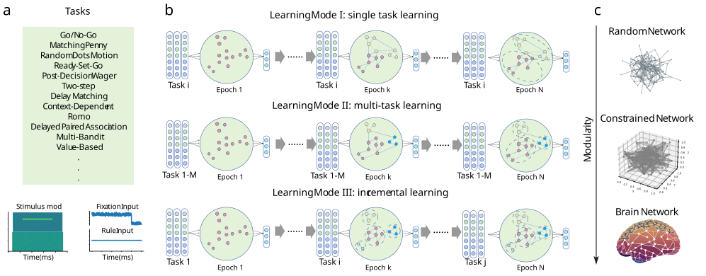
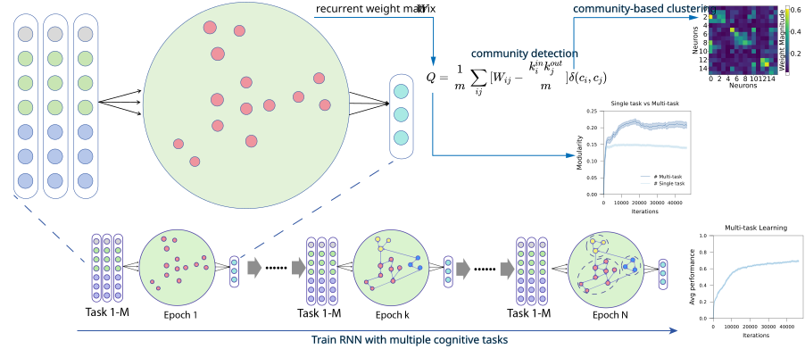

# Task-structured modularity emerges in artificial networks and aligns with brain architecture

## Contents

- [Overview](#overview)
- [Repo Contents](#repo-contents)
- [System Requirements](#system-requirements)
- [Installation Guide](#installation-guide)
- [Training](#training)
- [Plot Results](#plot-results)
- [Overall Workflow](#overall-workflow)
- [Citation](#citation)
- [License](./LICENSE)
- [Issues](https://github.com/brain-intelligence-lab/modular-brain-rnn/issues)

## Overview

This is the official repository for **[Task-structured modularity emerges in artificial networks and aligns with brain architecture](https://www.nature.com/articles/s42256-026-01306-9)**, published in *Nature Machine Intelligence* on 28 September 2026.

In this study, we demonstrate that multitask and incremental learning enhance modularity in recurrent neural networks (RNNs) compared to single-task learning, revealing how functional demands influence the structural organization of neural networks.



## Repo Contents

- [Data](./datasets/brain_hcp_data/84/): Data from The Human Connectome Project.
- [Python](./): Main Python source code (see `main.py`, `models/`, `functions/utils/`, etc.).
- [Shell scripts](./scripts): Shell scripts are used to automate and manage multiple parallel Python tasks (see `Fig2.a.sh`, `Fig2.b-h.sh`, `Fig4.sh`, etc.).

## System Requirements

### Hardware Requirements

- A modern CPU or GPU (NVIDIA recommended for deep learning tasks)
- Sufficient disk space for data and model checkpoints

### Dependencies

- Python 3.9
- PyTorch 1.13.1
- NumPy 1.23.5
- SciPy 1.13.1
- Bctpy 0.6.1
- (See [requirements.txt](./requirements.txt) for full list)

## Installation Guide

1. Clone the repository:
    ```bash
    git clone git@github.com:brain-intelligence-lab/modular-brain-rnn.git
    cd modular-brain-rnn
    ```
2. Create and activate a virtual environment:
    ```bash
    conda create -n mod_rnn python=3.9
    conda activate mod_rnn
    ```
3. Install dependencies:
    ```bash
    pip install -r requirements.txt
    ```


## Training

Run the following commands from the repository root. The shell scripts automate multiple parallel Python tasks and default to GPU IDs 0–7; adjust their GPU lists and concurrency to match your hardware.

To start single task learning, use Fig2.a.sh to train all 20 tasks independently:

```bash
./scripts/Fig2.a.sh
```
To start multi-task learning, use Fig2.b-h.sh to train multiple tasks together:

```bash
./scripts/Fig2.b-h.sh
```
For other experiments in the paper, just use the corresponding scripts.


## Plot Results

Once training is complete, you can generate the figures used in the paper by running the corresponding Python plot scripts:

```bash
python plot_Fig2.py
```

Training logs and generated figures can be found in `./runs` and `./figures`, respectively.

NOTE:
Before repeating an experiment, use a fresh log directory or rename the previous run directory (e.g., `mv ./runs/Fig2a ./runs/Fig2a_pre`) to prevent the SummaryWriter from appending new log data, which could lead to incorrect plotting.


## Overall Workflow



## Citation

If you use this repository in your research, please cite:

Wu, Y., Deng, S., Du, K., Mattar, M. G., Wu, Y., Bassett, D. S., Tang, H., Pan, G. & Gu, S. Task-structured modularity emerges in artificial networks and aligns with brain architecture. *Nature Machine Intelligence* (2026).

```bibtex
@article{Wu_2026,
  title={Task-structured modularity emerges in artificial networks and aligns with brain architecture},
  ISSN={2522-5839},
  url={http://dx.doi.org/10.1038/s42256-026-01306-9},
  DOI={10.1038/s42256-026-01306-9},
  journal={Nature Machine Intelligence},
  publisher={Springer Science and Business Media LLC},
  author={Wu, Yuhang and Deng, Shikuang and Du, Kangrui and Mattar, Marcelo G. and Wu, Yifan and Bassett, Dani S. and Tang, Huajin and Pan, Gang and Gu, Shi},
  year={2026},
  month=Sept
}
```
