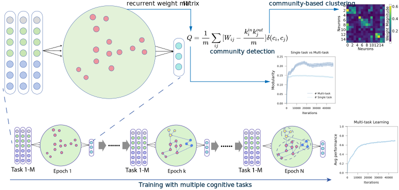

# Task-structured Modularity Emerges in Artificial Networks and Aligns with Brain Architecture

## Contents

- [Overview](#overview)
- [Repo Contents](#repo-contents)
- [System Requirements](#system-requirements)
- [Installation Guide](#installation-guide)
- [Demo](#demo)
- [Results](#results)
- [License](./LICENSE)
- [Issues](https://github.com/brain-intelligence-lab/modular-brain-rnn/issues)
- [Citation](#citation)

# Overview

This is the official repository for **Task-structured Modularity Emerges in Artificial Networks and Aligns with Brain Architecture**.  
In this study, we demonstrate that multitask and incremental learning enhance modularity in recurrent neural networks (RNNs) compared to single-task learning, revealing how functional demands influence the structural organization of neural networks.


# Repo Contents

- [Data](./datasets/brain_hcp_data/84/): Data from The Human Connectome Project.
- [Python](./): Main Python source code (see `main.py`, `models/`, `utils/`, etc.).
- [Shell scripts](./): Shell scripts are used to automate and manage multiple \
 parallel Python tasks (see `Fig2.a.sh`, `Fig2.bcde.sh`, `Fig3.a.sh`, etc.).

# System Requirements

## Hardware Requirements

- A modern CPU or GPU (NVIDIA recommended for deep learning tasks)
- Sufficient disk space for data and model checkpoints

### Dependencies

- Python 3.9
- PyTorch 1.13.1
- NumPy 1.23.5
- SciPy 1.13.1
- Bctpy 0.6.1
- (See [requirements.txt](./requirements.txt) for full list)

# Installation Guide

1. Clone the repository:
    ```bash
    git clone git@github.com:brain-intelligence-lab/modular-brain-rnn.git
    cd modular-brain-rnn
    ```
2. Create and activate a virtual environment:
    ```bash
    conda create -n mod_rnn python=3.9
    conda activate mod_rnn
    ```
3. Install dependencies:
    ```bash
    pip install -r requirements.txt

    # (optional) Only needed by some supplementary experiments
    # (For CNN, GNN community detection)
    conda install -c conda-forge r-base
    conda install rpy2

    # (optional) Install torch_geometric dependencies (For GNN training)
    # Install pyg_lib torch_cluster torch_scatter torch_sparse torch_spline_conv 
    # from https://data.pyg.org/whl/torch-1.13.0%2Bcu117.html
    # Take pyg_lib for example:

    wget https://data.pyg.org/whl/torch-1.13.0%2Bcu117/pyg_lib-0.4.0%2Bpt113cu117-cp39-cp39-linux_x86_64.whl
    pip install pyg_lib-0.4.0+pt113cu117-cp39-cp39-linux_x86_64.whl 

    # Then we can install torch_geometric using:
    pip install torch_geometric
    ```


# Demo

To run the main.py manually,
```bash
conda activate mod_rnn
mkdir -p ./runs/Fig2bcde_data/n_rnn_16_task_20_seed_100

python main.py --n_rnn $16 --rec_scale_factor 0.1 \
    --task_num 20 --gpu 0 --seed 100 --non_linearity relu \
    --save_model --max_trials 3000000 \
    --log_dir ./runs/Fig2bcde_data/n_rnn_16_task_20_seed_100 
```
or use the shell script to automate and manage multiple parallel Python tasks

```bash
./Fig2.a.sh
```
# Overall Workflow



# Results

Results and figures can be found in the `./runs` and `./figures` directory.  

# Citation

If you use this code or data, please cite:
```
@article{YourCitation2025,
  title={Task-structured Modularity Emerges in Artificial Networks and Aligns with Brain Architecture},
  author={Your Name and Collaborators},
  journal={Journal Name},
  year={2025}
}
```


